## Why this document? 
The Urban Analytics team works with a GitHub repository to document and share code. The urbanana GitHub repository is private and can be accessed by invitation only. 

## What do you need? 
In this section I give a brief description of what you need and why. The details of what to do in order to get GitHub running are discribed later in this document.
To get acceess to the urbanana GitHub reposotory you need to: 

1. Install Git on you computer. Git is the system that is used to do version control of your code. For those working with the Urban Analytics server, Git is already installed on the server.

2. Create a GitHub account. This is a service that works with Git and provides server space to host your code. Your local Git makes sure that the version control in done properly and that the code is pushed to the GitHub Server.

3. Create a project with Version control in R Studio and use the GitHub repository URL to establish a connection between your project environment and the GitHub repository. Since the urbanana repository is private, a slight change has to be done to the repository URL. The devil is in the details! So read carefully and don't rush to copy paste the URL. 

## Step 1. Install Git on your computer
Go to https://git-scm.com/downloads and install the appropriate version.

## Step 2: Create a GitHub account
- Go to https://github.com and create a GitHub account

- Make sure you get an invitation to urbanana GitHub repositories

## Step 3: Create an R Project with Git version control
### Create a new project in R Studio and make sure you choose Version Control. 

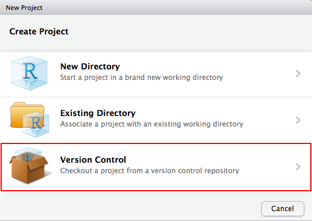

### After choosing Version Control choose Git.

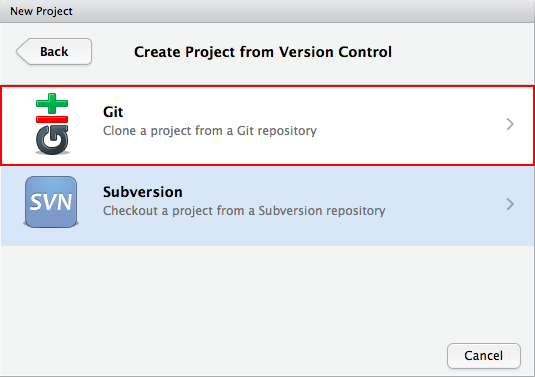

After choosing Git you get a window in which you can fill in the repository URL. 

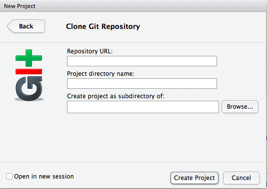

### From your webbrowser copy the repository URL

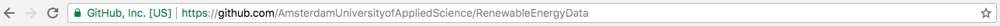

### Add YourUserName@ to the URL

After copying the repository URL, make sure you add your username followed by @ in front of github.com. As soon as you copy the URL the name of the directory is filled in automatically. Make sure you choose an appropriate folder to save the files by clicking on `Browse...`

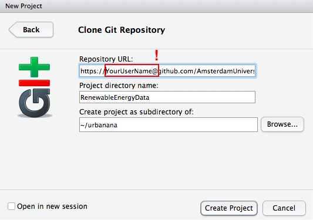

## Step 4: Use Git to pull, commit and push code

Once you created a R Project with Git version control, the Git Icon appears in the upper bar. 

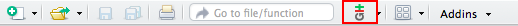

### Pull the branches

Make a habit to first pull the latest version of the code from the GitHub repository.

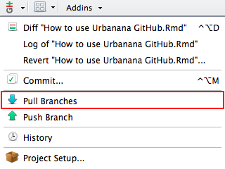

If everything is up to date you get the following message:

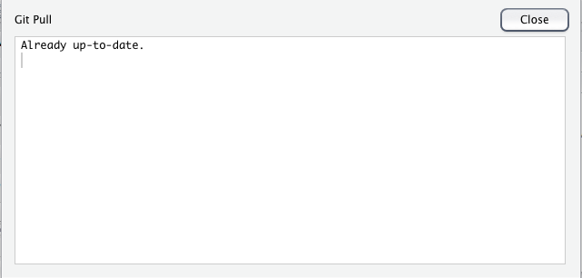

### Commit changes

After adding changes to your code, you have to commit these first before pushing the changes to the GitHub repository. Click on the Git icon and choose commit. When committhing keep these three things in mind:

- First, select the files that you made changes to or added to the reository. When you select the files you see an 'M' or and 'A'. An 'M' stands for Merge and means that the file is already in the GitHub repository and that the changes you made will be merged to an existing file. An 'A' stands for Add and means that the files are not in the GitHub repository yet. It is important to NOT select the files with the extension `.gitignore` and `.Rproj`!

- Second, add comments. A short description of the changes you made makes it easier to trace back what has been done. If you leave the comment section empty, you will get an error message! 

- Third, click on commit. 

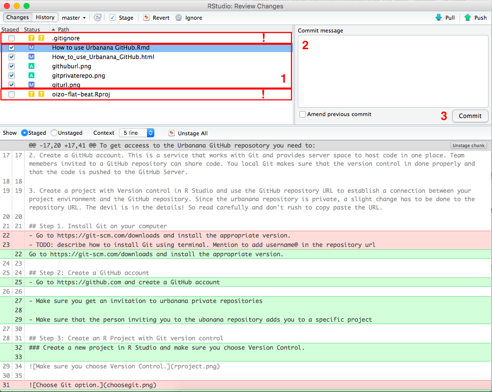

If everything is done correctly, you will get a message that the new files are READY to be added / merged to the repository. 

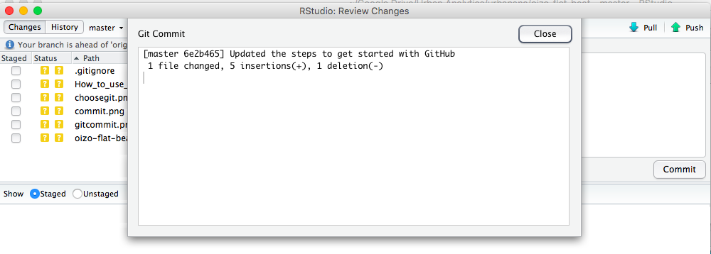

### Push changes

After committing the changes you can push the files to the GitHub repository. 

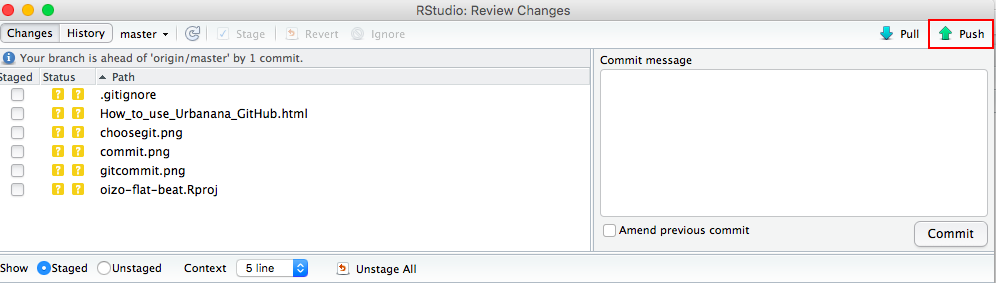

If everything is done right, you will get a message that the new files are merged / added to the GitHub repository. 

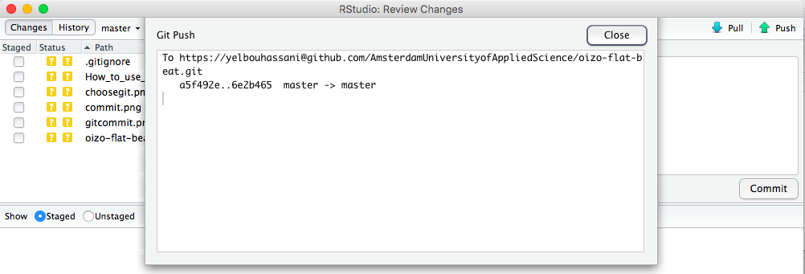

